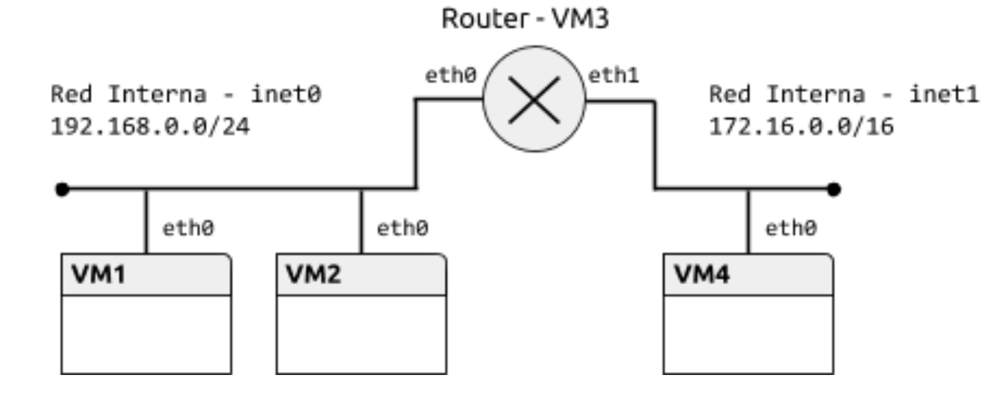
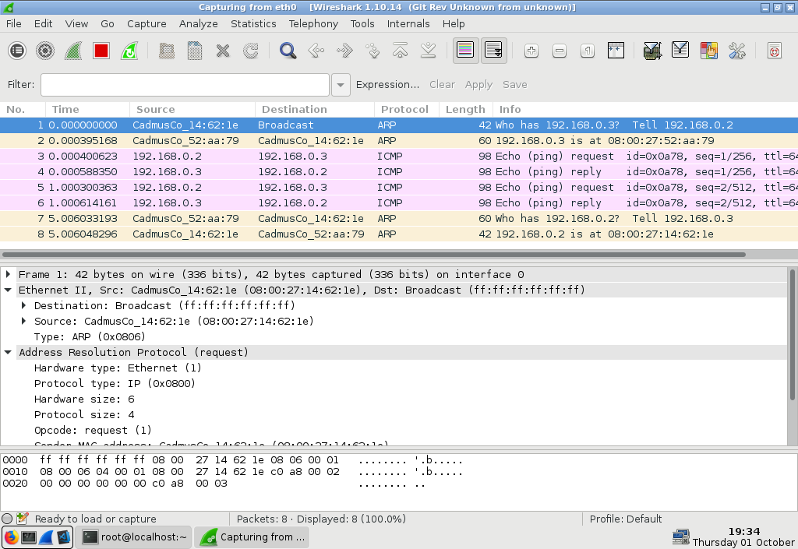
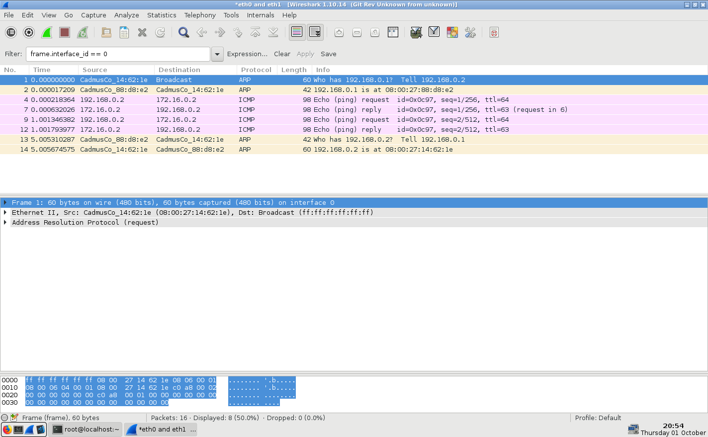
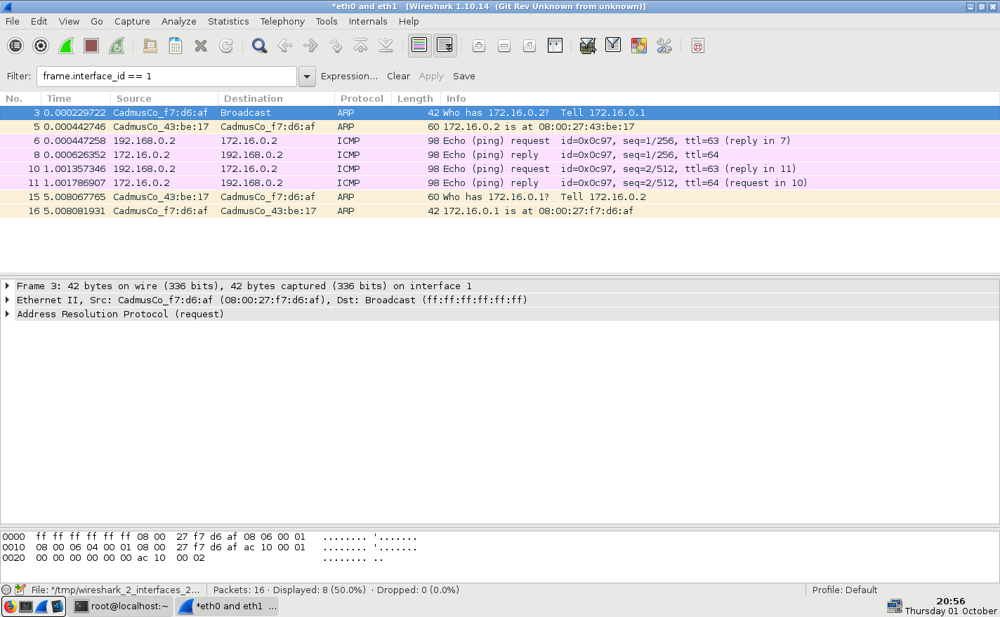
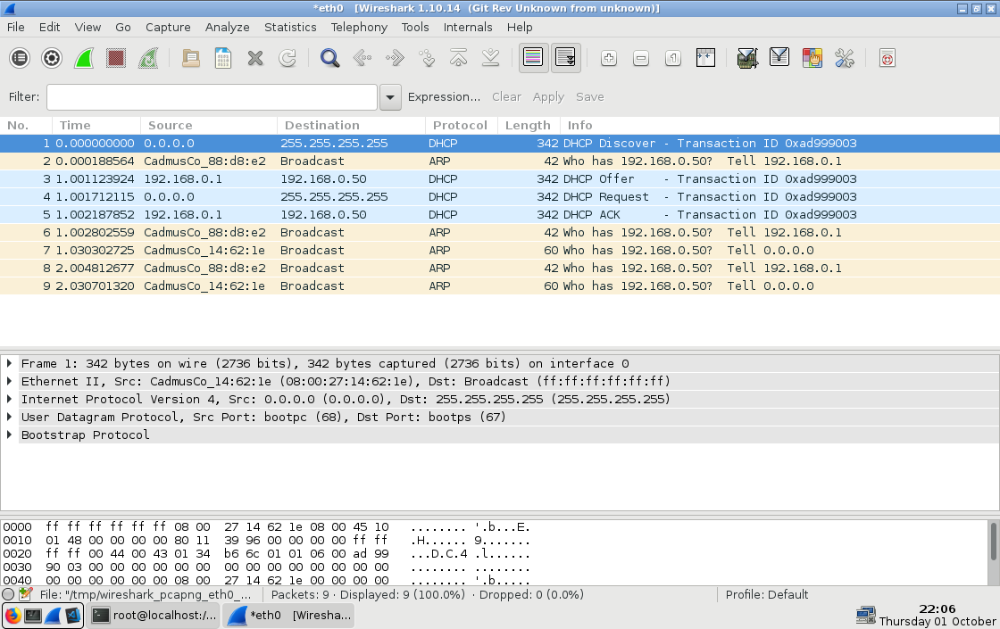

# Practica 1: Protocolo IPv4. Servicio DHCP.

## Objetivo
En esta práctica se presentan las herramientas que se utilizarán en la asignatura y se repasan brevemente los aspectos básicos del protocolo IPv4. Además, se analizan las características del protocolo DHCP.

## Contenidos
1. [Preparación del entorno para la práctica](#Preparacion-del-entorno-para-la-practica)
    * [Topología de la red](#Topologia-de-la-red)
2. [Configuración estática](#Configuracion-estatica)
    * [Ejercicio 1](#Ejercicio-1)
    * [Ejercicio 2](#Ejercicio-2)
    * [Ejercicio 3](#Ejercicio-3)
    * [Ejercicio 4](#Ejercicio-4)
    * [Ejercicio 5](#Ejercicio-5)
3. [Encaminamiento estático](#Encaminamiento-estatico)
    * [Ejercicio 6](#Ejercicio-6)
    * [Ejercicio 7](#Ejercicio-7)
    * [Ejercicio 8](#Ejercicio-8)
    * [Ejercicio 9](#Ejercicio-9)
4. [Configuración dinámica](#Configuracion-dinamica)
    * [Ejercicio 10](#Ejercicio-10)
    * [Ejercicio 11](#Ejercicio-11)
    * [Ejercicio 12](#Ejercicio-12)
    * [Ejercicio 13](#Ejercicio-13)
    * [Ejercicio 14](#Ejercicio-14)

## Preparacion del entorno para la practica Configuracion estatica

### Topologia de la red.



## Configuracion estatica

### Ejercicio 1

Determinar los interfaces de red que tiene la máquina y las direcciones IP y MAC que tienen asignadas. Utilizar el comando ​ip​.

En la VM1:
```console
[root@localhost ~]# ip a
1: lo: <LOOPBACK,UP,LOWER_UP> mtu 65536 qdisc noqueue state UNKNOWN group default qlen 1000
    link/loopback 00:00:00:00:00:00 brd 00:00:00:00:00:00 inet 127.0.0.1/8 scope host lo
    valid_lft forever preferred_lft forever inet6 ::1/128 scope host
    valid_lft forever preferred_lft forever
2: eth0: <BROADCAST,MULTICAST,UP,LOWER_UP> mtu 1500 qdisc pfifo_fast state UP group default qlen 1000
    link/ether 08:00:27:14:62:1e brd ff:ff:ff:ff:ff:ff inet 192.168.0.2/24 scope global eth0
    valid_lft forever preferred_lft forever inet6 fe80::a00:27ff:fe14:621e/64 scope link
    valid_lft forever preferred_lft forever
```

### Ejercicio 2

Activar los interfaces ​eth0 en VM1, VM2 y Router, y asignar una dirección IP adecuada. La configuración debe realizarse con la utilidad ​ip​, en particular los comandos ​ip address​ e ​ip link​.

En la VM1:
```console
[root@localhost ~]# ip l set eth0 up
[root@localhost ~]# ip a add 192.168.0.2/24 dev eth0
```

En la VM2
```console
[root@localhost ~]# ip l set eth0 up
[root@localhost ~]# ip a add 192.168.0.3/24 dev eth0
```

En el ROUTER:
```console
[root@localhost ~]# ip l set eth0 up
[root@localhost ~]# ip a add 192.168.0.1/24 dev eth0
```

### Ejercicio 3

Abrir la herramienta Wireshark en VM1 e iniciar una captura en el interfaz de red. Comprobar la conectividad entre VM1 y VM2 con la orden ​ping​. Observar el tráfico generado, especialmente los protocolos encapsulados en cada datagrama y las direcciones origen y destino. Para ver correctamente el tráfico ARP, puede ser necesario eliminar la tabla ARP en VM1 con la orden ​ip neigh flush dev eth0​.

Completar la siguiente tabla para todos los mensajes intercambiados hasta la recepción de la primera respuesta Echo Reply:
* Anotar las direcciones MAC e IP de los mensajes.
* Para cada protocolo, anotar las características importantes (p. ej. pregunta/respuesta ARP o
tipo ICMP) en el campo “Tipo de mensaje”.
* Comparar los datos observados durante la captura con el formato de los mensajes estudiados
en clase.

|MAC Origen|MAC Destino|Protocolo|IP Origen|IP Destino|Tipo Mensaje|
|:---:|:---:|:---:|:---:|:---:|:---:|
|08:00:27:14:62:1e|00:00:00:00:00:00|ARP|192.168.0.2|192.168.0.3|Who has 192.168.0.3? Tell 192.168.0.2|
|08:00:27:52:aa:79|08:00:27:14:62:1e|ARP|192.168.0.3|192.168.0.2|192.168.0.3 is at 08:00:27:52:aa:79|
|08:00:27:14:62:1e|08:00:27:52:aa:79|ICMP|192.168.0.2|192.168.0.3|Echo (ping)|
|08:00:27:52:aa:79|08:00:27:14:62:1e|ICMP|192.168.0.3|192.168.0.2|Echo (reply)|

En la VM1:
```console
[root@localhost ~]# ping -c 2 192.168.0.3
PING 192.168.0.3 (192.168.0.3) 56(84) bytes of data.
64 bytes from 192.168.0.3: icmp_seq=1 ttl=64 time=0.519 ms 64 bytes from 192.168.0.3: icmp_seq=2 ttl=64 time=0.810 ms
--- 192.168.0.3 ping statistics ---
2 packets transmitted, 2 received, 0% packet loss, time 1000ms rtt min/avg/max/mdev = 0.519/0.664/0.810/0.147 ms
```

Captura de pantalla del wireshark:


### Ejercicio 4

Ejecutar de nuevo la orden ​ping entre VM1 y VM2 y, a continuación, comprobar el estado de la tabla ARP en VM1 y VM2 usando el comando ip neigh​. El significado del estado de cada entrada de la tabla se puede consultar en la página de manual del comando.

En la VM1:
```console
[root@localhost ~]# ip ne
192.168.0.3 dev eth0 lladdr 08:00:27:52:aa:79 REACHABLE 192.168.0.1 dev eth0 lladdr 08:00:27:88:d8:e2 STALE
```

En la VM2:
```console
[root@localhost ~]# ip ne
192.168.0.1 dev eth0 lladdr 08:00:27:88:d8:e2 STALE
192.168.0.2 dev eth0 lladdr 08:00:27:14:62:1e STALE
```

Descripción de los posibles estados:
|Estado|Significado|
|:---:|:---|
|**REACHABLE**​|Entrada válida y con conectividad|
|**STALE​**|Entrada válida y sin conectividad|
|**FAILED**​|Sin conectividad y no ha sido detectada la MAC|
|**DELAY​**|Se ha enviado un paquete y se espera confirmación|

### Ejercicio 5
Configurar Router y VM4 y comprobar su conectividad con el comando ​ping​.

En el ROUTER:
```console
[root@localhost ~]# ip l set eth1 up
[root@localhost ~]# ip a add 172.16.0.1/16 dev eth1 
[root@localhost ~]# ping -c 2 172.16.0.2
PING 172.16.0.2 (172.16.0.2) 56(84) bytes of data.
64 bytes from 172.16.0.2: icmp_seq=1 ttl=64 time=0.370 ms 64 bytes from 172.16.0.2: icmp_seq=2 ttl=64 time=0.396 ms
--- 172.16.0.2 ping statistics ---
2 packets transmitted, 2 received, 0% packet loss, time 999ms rtt min/avg/max/mdev = 0.370/0.383/0.396/0.013 ms
```

En la VM4:
```console
[root@localhost ~]# ip l set eth0 up
[root@localhost ~]# ip a add 172.16.0.2/16 dev eth0 
[root@localhost ~]# ping -c 2 172.16.0.1
PING 172.16.0.1 (172.16.0.1) 56(84) bytes of data.
64 bytes from 172.16.0.1: icmp_seq=1 ttl=64 time=0.528 ms 64 bytes from 172.16.0.1: icmp_seq=2 ttl=64 time=0.368 ms
--- 172.16.0.1 ping statistics ---
2 packets transmitted, 2 received, 0% packet loss, time 1000ms rtt min/avg/max/mdev = 0.368/0.448/0.528/0.080 ms
```

## Encaminamiento Estatico

### Ejercicio 6
Activar el reenvío de paquetes (​forwarding)​ en Router para que efectivamente pueda funcionar como encaminador entre las redes. Ejecutar el siguiente comando:
```console
$ ​sudo sysctl net.ipv4.ip_forward=1
```

En el ROUTER:
```console
[root@localhost ~]# sysctl net.ipv4.ip_forward=1 net.ipv4.ip_forward = 1
```

### Ejercicio 7
Añadir Router como encaminador por defecto para VM1 y VM2. Usar el comando​ ip route​.

En la VM1:
```console
[root@localhost ~]# ip route add default via 192.168.0.1
[root@localhost ~]# ip route
default via 192.168.0.1 dev eth0
192.168.0.0/24 dev eth0 proto kernel scope link src 192.168.0.2
```

En la VM2:
```console
[root@localhost ~]# ip route add default via 192.168.0.1
[root@localhost ~]# ip route
default via 192.168.0.1 dev eth0
192.168.0.0/24 dev eth0 proto kernel scope link src 192.168.0.3
```

### Ejercicio 8
Aunque la configuración adecuada para la tabla de rutas en redes como las consideradas en esta práctica consiste en añadir una ruta por defecto, es posible incluir rutas para redes concretas. Añadir en VM4 una ruta a la red 192.168.0.0/24 via Router. Usar el comando ip route​.

```console
[root@localhost ~]# ip route add 192.168.0.0/24 via 172.16.0.1 
[root@localhost ~]# ip route
172.16.0.0/16 dev eth0 proto kernel scope link src 172.16.0.2 192.168.0.0/24 via 172.16.0.1 dev eth0
```

### Ejercicio 9
Abrir la herramienta Wireshark en Router e iniciar una captura en sus dos interfaces de red. Eliminar la tabla ARP en VM1 y Router. Usar la orden ​ping entre VM1 y VM4. Completar la siguiente tabla para todos los paquetes intercambiados hasta la recepción del primer Echo Reply.​

#### Red 192.168.0.0/24 - Router (eth0)
|MAC Origen|MAC Destino|Protocolo|IP Origen|IP Destino|Tipo Mensaje|
|:---:|:---:|:---:|:---:|:---:|:---:|
|08:00:27:14:62:1e|00:00:00:00:00:00|ARP|192.168.0.2|192.168.0.1|Who has 192.168.0.1? Tell 192.168.0.2|
|08:00:27:88:d8:e2|08:00:27:14:62:1e|ARP|192.168.0.1|192.168.0.2|192.168.0.1 is at 08:00:27:88:d8:e2|
|08:00:27:14:62:1e|08:00:27:88:d8:e2|ICMP|192.168.0.2|192.168.0.1|Echo (ping)|
|08:00:27:88:d8:e2|08:00:27:14:62:1e|ICMP|192.168.0.1|192.168.0.2|Echo (reply)|

#### Red 172.16.0.0/16 - Router (eth1)
|MAC Origen|MAC Destino|Protocolo|IP Origen|IP Destino|Tipo Mensaje|
|:---:|:---:|:---:|:---:|:---:|:---:|
|08:00:27:f7:d6:af|00:00:00:00:00:00|ARP|172.16.0.1|172.16.0.2|Who has 172.16.0.2? Tell 172.16.0.1|
|08:00:27:43:be:17|08:00:27:f7:d6:af|ARP|172.16.0.2|172.16.0.1|172.16.0.2 is at 08:00:27:43:be:17|
|08:00:27:f7:d6:af|08:00:27:43:be:17|ICMP|172.16.0.1|172.16.0.2|Echo (ping)|
|08:00:27:43:be:17|08:00:27:f7:d6:af|ICMP|172.16.0.2|172.16.0.1|Echo (reply)|

Captura de pantalla del wireshark en eth0:


Captura de pantalla del wireshark en eth1:


## Configuracion dinamica
El protocolo DHCP permite configurar dinámicamente los parámetros de red de una máquina. En esta sección configuraremos Router como servidor DHCP para las dos redes. Aunque DHCP puede incluir muchos parámetros de configuración, en esta práctica sólo fijaremos el encaminador por defecto.

### Ejercicio 10
Eliminar las direcciones IP de los interfaces (​ip addr del​) de todas las máquinas salvo Router.

En la VM1:
```console
[root@localhost ~]# ip a del 192.168.0.2/24 dev eth0
```

En la VM2:
```console
[root@localhost ~]# ip a del 192.168.0.3/24 dev eth0
```

En la VM4:
```console
[root@localhost ~]# ip a del 172.16.0.2/16 dev eth0
```

### Ejercicio 11
Configurar el servidor DHCP para las dos redes​:
* Editar el fichero ​/etc/dhcp/dhcpd.conf y añadir dos secciones ​subnet​, una para cada red, que definan los rangos de direcciones​, 1​ 92.168.0.50-192.168.0.100 y 172.16.0.50-172.16.0.100​, respectivamente. Además, incluir la opción ​routers con la dirección IP de Router en cada red. Ejemplo:

```console
subnet 192.168.0.0 netmask 255.255.255.0 {
    range 192.168.0.11 192.168.0.50; option routers 192.168.0.3;
    option broadcast-address 192.168.0.255;
}
```

* Arrancar el servicio con el comando ​service dhcpd start​.

Configuración del DHCP:
```bash
#
# DHCP Server Configuration file.
# see/usr/share/doc/dhcp*/dhcpd.conf.example # seedhcpd.conf(5)manpage
#
subnet 192.168.0.0 netmask 255.255.255.0 { 
    range 192.168.0.50 192.168.0.100;
    option routers 192.168.0.1;
    option broadcast-address 192.168.0.255;
}
subnet 172.16.0.0 netmask 255.255.0.0 { 
    range 172.16.0.50 172.16.0.100;
    option routers 172.16.0.1;
    option broadcast-address 172.16.255.255;
}
```

En el ROUTER:
```console
[root@localhost dhcp]# systemctl start dhcpd.service 
root@localhost dhcp]# systemctl status dhcpd.service 
● dhcpd.service - DHCPv4 Server Daemon
Loaded: loaded (/usr/lib/systemd/system/dhcpd.service; disabled; vendor preset: disabled) Active: active (running) since Thu 2020-10-01 21:59:28 CEST; 6s ago
Docs: man:dhcpd(8) man:dhcpd.conf(5)
Main PID: 4458 (dhcpd)
Status: "Dispatching packets..." CGroup: /system.slice/dhcpd.service
└─4458 /usr/sbin/dhcpd -f -cf /etc/dhcp/dhcpd.conf -user dhcpd -gr...
Oct 01 21:59:28 localhost.localdomain dhcpd[4458]: All rights reserved.
Oct 01 21:59:28 localhost.localdomain dhcpd[4458]: For info, please visit htt...
Oct 01 21:59:28 localhost.localdomain dhcpd[4458]: Not searching LDAP since l... Oct 01 21:59:28 localhost.localdomain dhcpd[4458]: Wrote 0 leases to leases f... Oct 01 21:59:28 localhost.localdomain dhcpd[4458]: Listening on LPF/eth1/08:0... Oct0121:59:28localhost.localdomaindhcpd[4458]:Sendingon LPF/eth1/08:0... Oct 01 21:59:28 localhost.localdomain dhcpd[4458]: Listening on LPF/eth0/08:0... Oct0121:59:28localhost.localdomaindhcpd[4458]:Sendingon LPF/eth0/08:0... Oct0121:59:28localhost.localdomaindhcpd[4458]:Sendingon Socket/fallba... Oct 01 21:59:28 localhost.localdomain systemd[1]: Started DHCPv4 Server Daemon. Hint: Some lines were ellipsized, use -l to show in full.
```

### Ejercicio 12
Iniciar una captura de paquetes en Router. Arrancar el cliente DHCP en VM1 con ​dhclient -d eth0​ y observar el proceso de configuración. Completar la siguiente tabla:

|IP Origen|IP Destino|Mensaje DHCP|Opciones DHCP|
|:---|:---|:---|:---|
|0.0.0.0|255.255.255.255|Discover|(53) DHCP Message Type <br> (50) Requested IP Address <br> (55) Parameter Request List <br> (255) End|
|192.168.0.1|192.168.0.50|Offer|(53) DHCP Message Type <br> (54) DHCP Server Identifier <br> (51) IP Address Lease Time <br> (1) Subnet Mask <br> (28) Broadcast Address<br> (3) Router <br> (255) End|
|0.0.0.0|255.255.255.255|Request|(53) DHCP Message Type <br> (54) DHCP Server Identifier <br> (50) Requested IP Address <br> (55) Parameter Request List <br> (255) End|
|192.168.0.1|192.168.0.50|ACK|(53) DHCP Message Type <br> (54) DHCP Server Identifier <br> (51) IP Address Lease Time <br> (1) Subnet Mask <br> (28) Broadcast Address <br> (3) Router <br> (255) End|

Captura de pantalla del wireshark:


### Ejercicio 13
D​urante el arranque del sistema se pueden configurar automáticamente interfaces según la información almacenada en el disco del servidor (configuración persistente). Consultar el fichero ​/etc/sysconfig/network-scripts/ifcfg-eth0 de VM4, que configura automáticamente eth0​ usando DHCP. Para configuración estática, se usarían las siguientes opciones:

```bash
TYPE=Ethernet
BOOTPROTO=none
IPADDR=​<dirección IP estática en formato CIDR>
GATEWAY=​<dirección IP estática del encaminador por defecto (si existe)>
DEVICE=eth0
```

**Nota**:​ Estas opciones se describen en detalle en ​/usr/share/doc/initscripts-*/sysconfig.txt​.

```console
[root@localhost network-scripts]# cat ifcfg-eth0 TYPE=Ethernet
BOOTPROTO=dhcp
DEFROUTE=yes
NAME=eth0
DEVICE=eth0
ONBOOT=no
```

### Ejercicio 14
Comprobar la configuración persistente con las órdenes ​ifup e ​ifdown​. Verificar la conectividad entre todas las máquinas de las dos redes.

En la VM4:
```console
[root@localhost network-scripts]# ifdown eth0 
[root@localhost network-scripts]# ifup eth0

Determining IP information for eth0... done.
[root@localhost network-scripts]# ping -c 2 192.168.0.50
PING 192.168.0.50 (192.168.0.50) 56(84) bytes of data.
64 bytes from 192.168.0.50: icmp_seq=1 ttl=63 time=1.30 ms 64 bytes from 192.168.0.50: icmp_seq=2 ttl=63 time=1.62 ms

--- 192.168.0.50 ping statistics ---
2 packets transmitted, 2 received, 0% packet loss, time 1002ms rtt min/avg/max/mdev = 1.308/1.466/1.624/0.158 ms
[root@localhost network-scripts]# ping -c 2 192.168.0.51
PING 192.168.0.51 (192.168.0.51) 56(84) bytes of data.
64 bytes from 192.168.0.51: icmp_seq=1 ttl=63 time=0.886 ms 64 bytes from 192.168.0.51: icmp_seq=2 ttl=63 time=0.877 ms

--- 192.168.0.51 ping statistics ---
2 packets transmitted, 2 received, 0% packet loss, time 1000ms rtt min/avg/max/mdev = 0.877/0.881/0.886/0.030 ms 
[root@localhost network-scripts]# ping -c 2 192.168.0.1
PING 192.168.0.1 (192.168.0.1) 56(84) bytes of data.
64 bytes from 192.168.0.1: icmp_seq=1 ttl=64 time=0.372 ms 64 bytes from 192.168.0.1: icmp_seq=2 ttl=64 time=0.532 ms

--- 192.168.0.1 ping statistics ---
2 packets transmitted, 2 received, 0% packet loss, time 1001ms rtt min/avg/max/mdev = 0.372/0.452/0.532/0.080 ms
[root@localhost network-scripts]# ping -c 2 172.16.0.1
PING 172.16.0.1 (172.16.0.1) 56(84) bytes of data.
64 bytes from 172.16.0.1: icmp_seq=1 ttl=64 time=0.412 ms 64 bytes from 172.16.0.1: icmp_seq=2 ttl=64 time=0.876 ms

--- 172.16.0.1 ping statistics ---
2 packets transmitted, 2 received, 0% packet loss, time 1002ms rtt min/avg/max/mdev = 0.412/0.644/0.876/0.232 ms
```